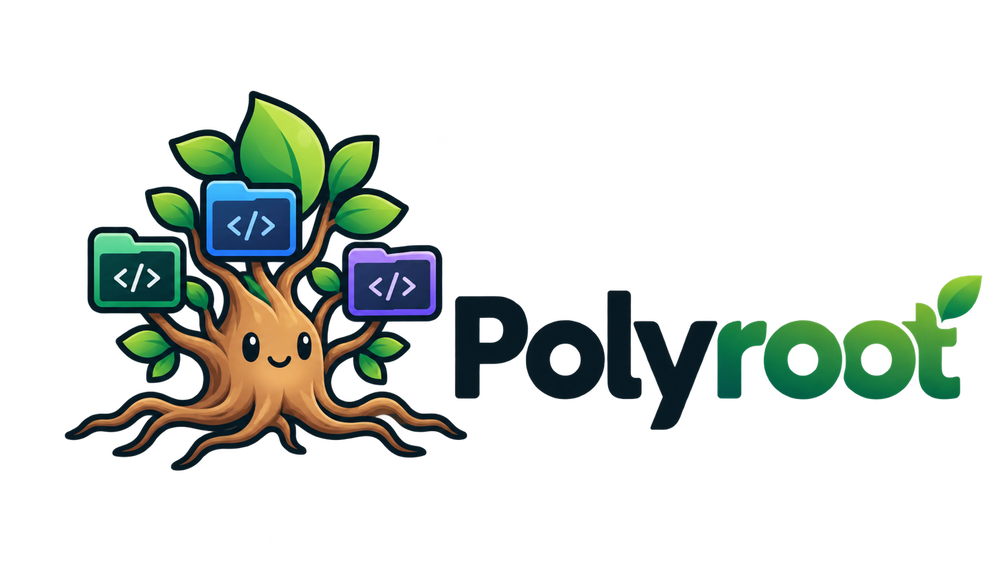

<p align="center">
  <picture>
    <source media="(prefers-color-scheme: dark)" srcset="docs/assets/logo-dark.png">
    
  </picture>
</p>

<p align="center">
  <strong>Multi-repo workspaces for coding agents.</strong><br>
  One codebase. Many repos. Any agent.
</p>

<p align="center">
  <a href="https://github.com/Kazaz-Or/polyroot/actions/workflows/ci.yml"></a>
  <a href="https://github.com/Kazaz-Or/polyroot/actions/workflows/codeql.yml"></a>
  <a href="https://goreportcard.com/report/github.com/Kazaz-Or/polyroot"></a>
  <a href="https://github.com/Kazaz-Or/polyroot/releases/latest"></a>
  <a href="https://pkg.go.dev/github.com/Kazaz-Or/polyroot"></a>
  <br>
  <a href="go.mod"></a>
  
  <a href="LICENSE"></a>
  <a href="https://github.com/Kazaz-Or/polyroot/releases"></a>
  <a href="CONTRIBUTING.md"></a>
</p>

<p align="center">
  
</p>

---

Your product isn't always one Git repository. Polyroot lets you define a
logical codebase once and open it with **Claude Code, Codex CLI, Gemini CLI,
OpenCode, Pi**, and other coding agents.

```bash
polyroot setup                                                    # once
polyroot workspace add payments ~/git/payments-api ~/git/payments-web ~/git/shared-sdk
polyroot payments                                                 # opens your agent on all three
```

- No duplicate clones.
- No giant monorepo migration.
- No repeated `--add-dir` flags.

## Contents

- [Why](#why)
- [Features](#features)
- [Installation](#installation)
- [Quick start](#quick-start)
- [Configuration](#configuration)
- [Commands](#commands)
- [Supported agents](#supported-agents)
- [How it works](#how-it-works)
- [Security and privacy](#security-and-privacy)
- [FAQ](#faq)
- [Non-goals](#non-goals)
- [Contributing](#contributing)
- [Contributors](#contributors)
- [License](#license)

## Why

A product like "payments" is often several repositories, and some of them are
shared with other products:

```text
~/git/
├── payments-api/      ┐
├── payments-web/      │ payments
├── payments-worker/   ┘
├── gaming-api/        ┐ gaming
├── gaming-web/        ┘
├── shared-sdk/        ┐
├── helm/              │ shared by every product
└── terraform/         ┘
```

To Git these are separate repositories. To you they're one codebase. Coding
agents start in one directory. Most can be given more, but each spells it
differently (`--add-dir`, `--include-directories`, permission config, ...),
and none knows that "payments" means these six repositories or what they're
for.

Polyroot is the missing layer:

```text
logical workspace → repos + shared groups → workspace context
                  → the agent's native multi-root mechanism → launch
```

## Features

- **Declarative workspaces.** Register each repository once, group shared
  ones, and compose workspaces from both. One repository can belong to any
  number of workspaces.
- **Any agent, native mechanisms.** Each adapter uses the agent's own
  multi-directory and instruction features. No symlinks, copies or clones.
- **Workspace context.** An auto-generated map of the repositories, plus your
  own markdown notes, delivered the least invasive way each agent supports.
- **Repository instructions preserved.** `CLAUDE.md`, `AGENTS.md` and
  `GEMINI.md` stay owned by their repositories and load natively where
  possible.
- **Transparent.** `polyroot command` prints the exact argv, cwd, environment
  and generated files before anything runs.
- **Customizable agents.** Give built-in agents default flags (for example
  `--model opus`), wrapper executables or environment, make named variants,
  or plug in any CLI agent with a generic adapter.
- **Safe by construction.** argv-only process execution (no shell, no
  `eval`). `/` and `$HOME` are rejected as repositories. Nothing is written
  to your repositories or your agents' global config.
- **Fails loudly.** An agent that can't represent a workspace gets an error
  that explains why. Repositories are never dropped silently.
- **Small and offline.** A single static Go binary with no daemon, database,
  telemetry or network access.

## Installation

**Install script (macOS and Linux):**

```bash
curl -fsSL https://raw.githubusercontent.com/Kazaz-Or/polyroot/master/install.sh | sh
```

The script detects your OS and CPU, downloads the matching release archive,
verifies its SHA-256 checksum, and installs `polyroot` to `~/.local/bin`. It
never uses sudo. You can change the version or install directory:

```bash
curl -fsSL https://raw.githubusercontent.com/Kazaz-Or/polyroot/master/install.sh \
  | POLYROOT_VERSION=v0.1.0 POLYROOT_INSTALL_DIR=/usr/local/bin sh
```

Prefer to read it first? `curl -fsSLO …/install.sh && less install.sh && sh install.sh`.

**Other methods:**

| Method | Command |
|---|---|
| Go 1.24+ | `go install github.com/Kazaz-Or/polyroot/cmd/polyroot@latest` |
| Binary | download from [Releases](https://github.com/Kazaz-Or/polyroot/releases) |
| From source | `git clone https://github.com/Kazaz-Or/polyroot && cd polyroot && go build ./cmd/polyroot` |

To uninstall, run `rm ~/.local/bin/polyroot`. Optionally also delete
`~/.config/polyroot` and `~/.cache/polyroot`.

Supported platforms:

| OS | amd64 | arm64 |
|---|---|---|
| macOS | ✅ | ✅ (Apple silicon) |
| Linux | ✅ | ✅ |

Windows isn't supported.

<details>
<summary>Install from a release archive manually</summary>

```bash
VERSION=0.1.0
OS=$(uname -s | tr '[:upper:]' '[:lower:]')          # darwin or linux
ARCH=$(uname -m | sed 's/x86_64/amd64/;s/aarch64/arm64/')
curl -fsSLO "https://github.com/Kazaz-Or/polyroot/releases/download/v${VERSION}/polyroot_${VERSION}_${OS}_${ARCH}.tar.gz"
tar -xzf "polyroot_${VERSION}_${OS}_${ARCH}.tar.gz" polyroot
sudo mv polyroot /usr/local/bin/
```

Checksums are published as `checksums.txt` with every release.
</details>

## Quick start

1. **Set up once.** Pick your default coding agent:

   ```console
   $ polyroot setup
   Which coding agent should Polyroot use by default?
   > claude    Claude Code  (installed)
     codex     Codex CLI    (installed)
     gemini    Gemini CLI
     opencode  OpenCode
     pi        Pi
   Created ~/.config/polyroot/config.yaml (default agent: claude)
   ```

   Use `polyroot setup --agent codex` to skip the prompt.

2. **Create a workspace** from the paths of its repositories. The first path
   is the *primary* repository, where the agent starts:

   ```console
   $ polyroot workspace add payments ~/git/payments-api ~/git/payments-web ~/git/shared-sdk
   Registered repo payments-api: ~/git/payments-api
   Registered repo payments-web: ~/git/payments-web
   Registered repo shared-sdk: ~/git/shared-sdk
   Created workspace "payments": primary payments-api, plus payments-web, shared-sdk

   Open it:  polyroot payments
   ```

   Run `polyroot workspace add` with no arguments to be prompted for the name,
   the paths and an optional description for the agent. Create as many
   workspaces as you like; a repository can be in any number of them:

   ```bash
   polyroot workspace add gaming ~/git/gaming-api ~/git/shared-sdk --agent codex
   polyroot workspace add payments ~/git/helm          # add a repo to an existing workspace
   polyroot workspace remove gaming
   ```

3. **Open it:**

   ```bash
   polyroot payments                                   # same as: polyroot open payments
   polyroot payments --agent gemini                    # another agent, this time
   polyroot payments -- --model opus                   # pass arguments to the agent
   ```

Everything ends up in a plain YAML file you can also [edit by hand](#configuration).
Polyroot's commands edit it in place, so your comments and manual changes are
kept, and the previous version is saved as `config.yaml.bak`.

## Configuration

`polyroot setup` and `polyroot workspace` write the config for you. You can
also edit it by hand for anything they don't cover: groups of shared
repositories, context files, per-workspace agents and custom agents. A
complete, commented example is in [`examples/config.yaml`](examples/config.yaml).

The config file is `config.yaml` in `$POLYROOT_CONFIG_HOME`, else
`$XDG_CONFIG_HOME/polyroot`, else `~/.config/polyroot`. The same rule applies
on macOS.

```yaml
version: 1
defaultAgent: claude

repos:                                   # every physical repo, registered once
  payments-api:
    path: ~/git/payments-api
  payments-web: ~/git/payments-web       # shorthand for {path: ...}
  payments-worker: ~/git/payments-worker
  gaming-api: ~/git/gaming-api
  shared-sdk: ~/git/shared-sdk
  helm: $HOME/git/helm
  terraform: ${HOME}/git/terraform

groups:                                  # reusable sets; may nest other groups
  infra:
    repos: [helm, terraform]
  platform:
    repos: [shared-sdk]
    groups: [infra]

workspaces:
  payments:
    primary: payments-api                # the agent's working directory
    repos: [payments-web, payments-worker]
    groups: [platform]
    context: contexts/payments.md        # relative to the config directory

  gaming:                                # shares platform repos with payments
    primary: gaming-api
    groups: [platform]
    defaultAgent: codex
```

| Key | Description |
|---|---|
| `version` | Schema version. Must be `1` |
| `defaultAgent` | Agent used when no `--agent` flag or workspace default is set |
| `repos.<name>.path` | Directory of an existing repository. Accepts `~`, `$VAR`, `${VAR}`, absolute paths and paths relative to the config file. Paths with spaces work. An unset variable is an error |
| `groups.<name>.repos` / `.groups` | Repositories and nested groups. Cycles are rejected |
| `workspaces.<name>.primary` | Required. The agent's working directory |
| `workspaces.<name>.repos` / `.groups` | Additional repositories |
| `workspaces.<name>.context` | Optional markdown file with workspace-level notes |
| `workspaces.<name>.defaultAgent` | Per-workspace agent override |
| `agents.<name>` | Override a built-in, extend it, or define a generic agent. See [Customizing agents](#customizing-agents) |

**Resolution rules:** primary first, then listed `repos` in order, then
`groups` depth-first in order. Duplicates keep their first position. Symlinks
are resolved, so two names for the same directory are reported as an error.

**Agent precedence:** `--agent` flag, then the workspace `defaultAgent`, then
the global `defaultAgent`.

### Workspace context

Polyroot generates a short, topology-only **workspace map** and appends your
`context:` file to it. It never includes source code:

```markdown
# Polyroot Workspace: payments

You are working in a logical multi-repository codebase.

Primary repository (your working directory):

- payments-api: /Users/me/git/payments-api [CLAUDE.md]

Additional repositories:

- payments-web: /Users/me/git/payments-web [AGENTS.md]
- shared-sdk: /Users/me/git/shared-sdk
...

Each repository is an independent Git repository. Run Git operations from the
appropriate repository root. ...

---

# Payments
A user checkout flows payments-web → payments-api → payments-worker. ...
```

### Customizing agents

The `agents:` section changes how agents are launched. It has three forms.

**1. Override a built-in agent.** Use the built-in name (`claude`, `codex`,
`gemini`, `opencode`, `pi`) as the key. The settings apply to every launch of
that agent:

```yaml
agents:
  claude:
    args: [--dangerously-skip-permissions]   # now `polyroot open payments` always adds it
    command: ~/bin/claude-wrapper            # optional: a different executable
    env:                                     # optional: extra environment
      CLAUDE_CODE_ADDITIONAL_DIRECTORIES_CLAUDE_MD: "0"
```

**2. A new name based on a built-in** (`extends`). It inherits any override of
that built-in and adds its own settings:

```yaml
agents:
  claude-opus:
    extends: claude
    args: [--model, opus]
  claude-yolo:
    extends: claude
    args: [--dangerously-skip-permissions]
```

```bash
polyroot open payments --agent claude-yolo
```

**3. A generic command adapter** for an agent Polyroot doesn't support yet:

```yaml
agents:
  my-agent:
    command: my-agent
    args: [--tui]
    addDirFlag: --add-dir    # emitted as [flag, path] per additional repo
    contextFlag: --rules     # receives the generated instructions file
    env:
      MY_AGENT_MODE: multi-repo
```

| Option | Built-in override | `extends` | Generic | Meaning |
|---|:-:|:-:|:-:|---|
| `extends` | — | required | — | Built-in adapter to base the agent on |
| `command` | optional | optional | required | Executable: a name looked up in `PATH`, or a path (`~`, `$VAR` and paths relative to the config file are expanded). Use it for wrappers or alternative installs |
| `args` | ✓ | ✓ | ✓ | Arguments added on every launch |
| `env` | ✓ | ✓ | ✓ | Environment variables. They take precedence over values Polyroot sets |
| `addDirFlag` | — | — | ✓ | Flag repeated once per additional repository. Without it, the agent refuses multi-repo workspaces rather than ignore repositories |
| `contextFlag` | — | — | ✓ | Flag that receives the generated workspace instructions file |

**Argument order** is: Polyroot's workspace flags, then the built-in
override's `args`, then the `extends` agent's `args`, then anything after
`--` on the command line. Run `polyroot command <ws> --agent <name>` to see
the result.

Every value becomes a separate argv element, with no templating, no shell and
no `eval`.

> **Warning:** flags like `--dangerously-skip-permissions` (Claude) or
> `--dangerously-bypass-approvals-and-sandbox` (Codex) let the agent run
> commands and edit files across **every repository in the workspace**
> without asking. Prefer a separate opt-in name (`claude-yolo`) over
> overriding `claude` itself.

## Commands

| Command | Description |
|---|---|
| `polyroot setup [--agent A]` | First-time setup: choose the default agent and create the config |
| `polyroot workspace add <name> <path>... [--primary P] [--agent A]` | Create a workspace from repository paths (first path is the primary), or add repositories to an existing one. No arguments: interactive |
| `polyroot workspace remove <name>` | Remove a workspace. Its repositories stay registered |
| `polyroot <ws> [--agent A] [-- args]` | Open the workspace (shorthand for `open`) |
| `polyroot open <ws> [--agent A] [-- args]` | Launch the agent on the workspace. Arguments after `--` are forwarded unchanged |
| `polyroot command <ws> [--agent A] [-- args]` | Print the exact launch spec (cwd, env, generated files, argv) without running it |
| `polyroot list` | List workspaces |
| `polyroot show <ws>` | Show the resolved repositories, their sources and the context file |
| `polyroot validate [ws] [--agent A]` | Validate the config, repo paths and whether the agent can represent the workspace |
| `polyroot agents` | Detected agents, versions and capabilities |
| `polyroot doctor` | Full diagnostics with suggested fixes |
| `polyroot completion <bash\|zsh\|fish>` | Print a shell completion script |
| `polyroot help [command]` | List every command and flag, or show one command's options |

Global flags: `-q/--quiet` (errors only), `-v/--verbose` (`open` prints the
launch spec first, `command` also prints the generated files, `agents` lists
problems), `-h/--help`, `--version`. `polyroot help` lists everything, and
every command has its own `--help`.

Interactive prompts (`setup`, `workspace add`) need a terminal. Set
`ACCESSIBLE=1` for plain line-by-line prompts that work with screen readers.

### Environment variables

| Variable | Effect |
|---|---|
| `POLYROOT_CONFIG_HOME` | Directory containing `config.yaml` (default `$XDG_CONFIG_HOME/polyroot` or `~/.config/polyroot`) |
| `POLYROOT_CACHE_HOME` | Directory for per-launch generated files (default `$XDG_CACHE_HOME/polyroot` or `~/.cache/polyroot`) |
| `ACCESSIBLE` | Set to `1` for plain, screen-reader friendly prompts in `setup` and `workspace add` |
| `XDG_CONFIG_HOME`, `XDG_CACHE_HOME` | Standard XDG base directories, used on macOS too |
| any `$VAR` | Expanded in repository paths, context paths and agent `command` paths. Unset variables are errors |

```console
$ polyroot list
NAME       PRIMARY        REPOS   DEFAULT AGENT
gaming     gaming-api     4       codex
payments   payments-api   6       claude

$ polyroot show payments
Workspace: payments

Primary:
  payments-api
  /Users/me/git/payments-api

Repositories:
  payments-api      /Users/me/git/payments-api
  payments-web      /Users/me/git/payments-web
  payments-worker   /Users/me/git/payments-worker
  shared-sdk        /Users/me/git/shared-sdk        [platform]
  helm              /Users/me/git/helm              [infra]
  terraform         /Users/me/git/terraform         [infra]

Context:
  ~/.config/polyroot/contexts/payments.md

$ polyroot open payments --agent claude -- --model opus
Workspace: payments
Agent: claude
Repositories: 6
Primary: ~/git/payments-api

Launching Claude Code...
```

```console
$ polyroot command payments --agent claude
agent:
  claude

cwd:
  /Users/me/git/payments-api

environment:
  CLAUDE_CODE_ADDITIONAL_DIRECTORIES_CLAUDE_MD=1

generated:
  /Users/me/.cache/polyroot/run/3f9c1a7b2e10/workspace.md

command:
  claude \
    --add-dir /Users/me/git/payments-web \
    --add-dir /Users/me/git/payments-worker \
    --add-dir /Users/me/git/shared-sdk \
    --add-dir /Users/me/git/helm \
    --add-dir /Users/me/git/terraform \
    --append-system-prompt-file /Users/me/.cache/polyroot/run/3f9c1a7b2e10/workspace.md
```

## Supported agents

| Agent | Tested | Extra repositories | Workspace context | Extra repos' instructions |
|---|---|---|---|---|
| [Claude Code](docs/agents/claude.md) | 2.1.287 | `--add-dir` | `--append-system-prompt-file` | `CLAUDE.md` via `CLAUDE_CODE_ADDITIONAL_DIRECTORIES_CLAUDE_MD=1` |
| [Codex CLI](docs/agents/codex.md) | 0.144.5 | `--add-dir` (writable roots) | `-c developer_instructions=…` | listed in the map |
| [Gemini CLI](docs/agents/gemini.md) | 0.62.0 | `--include-directories` | `GEMINI.md` in an included run dir | `GEMINI.md` in included dirs |
| [OpenCode](docs/agents/opencode.md) | 1.18.21 | `external_directory` permission (inline config) | `instructions` (inline config) | `AGENTS.md`/`CLAUDE.md` added to `instructions` |
| [Pi](docs/agents/pi.md) | 0.80.6 | not needed (Pi has no sandbox) | `--append-system-prompt <file>` | appended with `--append-system-prompt` |

Each agent page documents the exact mechanism, write permissions, generated
files and known limitations. The research behind the adapters is in
[docs/agent-capabilities.md](docs/agent-capabilities.md).

## How it works

```text
config.yaml ──► config      parse, expand and canonicalize paths, check references and cycles
                  │
                  ▼
               workspace   resolve primary + repos + groups (ordered, deduplicated), build the map
                  │          (knows nothing about agents)
                  ▼
               agent       adapter.Build → LaunchSpec {argv, cwd, env, generated files}
                  │
                  ▼
               runner      write files to ~/.cache/polyroot/run/<id> (0600), exec argv
                             (no shell), forward signals, clean up, return the agent's exit code
```

Adding an agent means one file implementing a three-method interface. See
[CONTRIBUTING.md](CONTRIBUTING.md#adding-an-agent).

## Security and privacy

- Agents are started with an argv array. Polyroot never runs `sh -c`, never
  uses `eval`, and never executes a quoted display string.
- The filesystem root, your home directory and any parent of it are rejected
  as repositories.
- Polyroot never writes to your repositories or to an agent's global
  configuration. Per-launch files live in `~/.cache/polyroot/run/<id>/` with
  mode `0600` and are removed when the agent exits.
- There's no telemetry and no network access. Agent detection runs
  `<agent> --version` and `--help` locally.

Report vulnerabilities privately as described in [SECURITY.md](SECURITY.md).

## FAQ

**Does Polyroot clone, pull or switch branches?**
No. It never runs Git commands that change anything. Every repository stays
an independent Git repository that you manage.

**Why not symlink everything into one directory?**
Symlink farms confuse Git, tools and agents, and they hide the real
repository boundaries. Every supported agent has a native way to work with
several directories, so Polyroot uses that.

**Can one repository belong to several workspaces?**
Yes. That's the main point. It exists once on disk and is referenced by name.

**What if my agent changes its flags?**
`polyroot agents` and `polyroot doctor` check each adapter's required flags
against the installed agent's `--help` and report incompatibilities.

**Where are my agent's own settings?**
Untouched. Polyroot only adds per-launch flags or environment variables,
which `polyroot command` shows.

## Non-goals

Polyroot isn't a Git client, repository manager, monorepo tool, worktree
manager, code indexer, RAG system, MCP server, agent orchestrator, terminal
multiplexer, dependency manager or build system. It does one job: **map a
logical multi-repository codebase onto the workspace primitives of coding
agents.**

## Contributing

Found a bug, have a question, or want support for another agent? Feel free to
[open an issue](https://github.com/Kazaz-Or/polyroot/issues/new/choose) or
send a pull request. Contributions of any size are welcome. Please read [CONTRIBUTING.md](CONTRIBUTING.md) and
the [Code of Conduct](CODE_OF_CONDUCT.md).

```bash
git clone https://github.com/Kazaz-Or/polyroot && cd polyroot
go test ./...                # unit and end-to-end tests; no real agents needed
go build ./cmd/polyroot
```

Every pull request runs lint, `govulncheck`, unit tests and end-to-end tests
on Linux (amd64, arm64) and macOS (Apple silicon, Intel). See
[`.github/workflows/ci.yml`](.github/workflows/ci.yml).

## Contributors

Thanks to everyone who has contributed to Polyroot.

<a href="https://github.com/Kazaz-Or/polyroot/graphs/contributors">
  
</a>

## License

[MIT](LICENSE) © The Polyroot Authors
